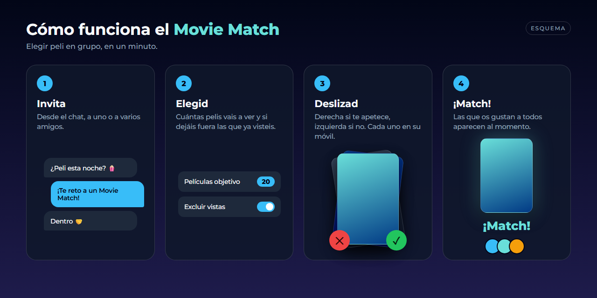
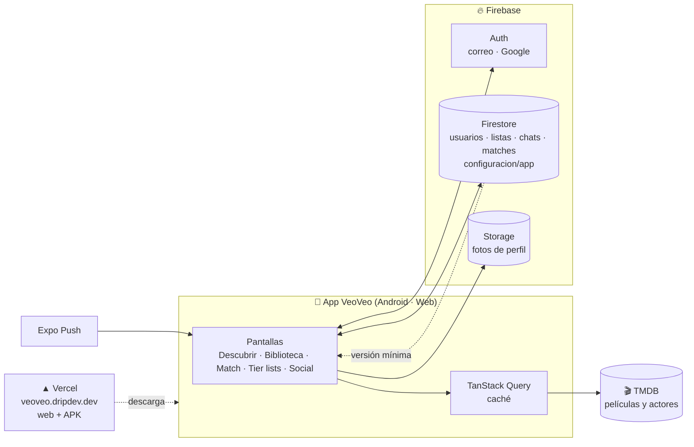
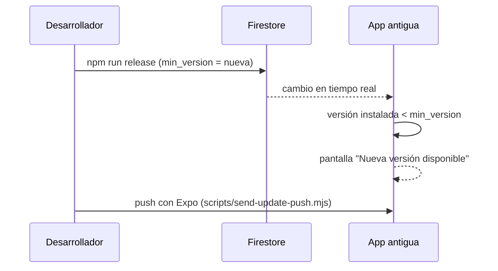

<a href="https://dripdev.dev"></a>

<p align="center">
  
</p>

<p align="center">
  <a href="https://github.com/roblesgg/veoveo/releases/latest"></a>
  <a href="https://veoveo.dripdev.dev"></a>
  
</p>

<p align="center">
  
  
  
  
  
</p>

<h3 align="center">🍿 Elegir peli con amigos ya no es una discusión: es un juego.</h3>

**VeoVeo** es una app para descubrir películas, llevar tu lista de lo que quieres ver y de lo que ya has visto, y decidir con tus amigos qué poner esta noche. Cada uno desliza en su móvil y, cuando coincidís, ya tenéis plan.

---

## Contenido

- [Qué puedes hacer](#qué-puedes-hacer)
- [Movie Match, a fondo](#movie-match-a-fondo)
- [Descárgala](#descárgala)
- [Camino a Google Play](#camino-a-google-play)
- [Cómo está hecha](#cómo-está-hecha)
- [Para desarrollar](#para-desarrollar)
- [Publicar una versión](#publicar-una-versión)
- [Tus datos](#tus-datos)

---

## Qué puedes hacer

### 🎬 Descubrir
- Carruseles de **Tendencias**, **Próximamente** y **Populares**.
- **Buscador** de películas y de actores.
- Ficha de cada película con su sinopsis, su reparto y sus datos.
- Ficha de cada **actor** con su filmografía.

### 👀 Tu biblioteca
- Marca cada peli como **Por ver** o **Vista**.
- **Valóralas** con estrellas… o con un 💩 si se lo merecen.
- **Filtros** para encontrar rápido lo que buscas.
- La biblioteca de tus amigos, para cotillear qué ven.

### 🤝 Movie Match
- Un juego por turnos de **deslizar en grupo** para elegir película. [Cómo funciona ↓](#movie-match-a-fondo)

### ⭐ Tier lists
- Ordena las películas que has visto **de mejor a peor**, por niveles.

### ❤️ Social
- **Amigos**, solicitudes y un buscador de usuarios.
- **Chat** con cada amigo, desde donde también se lanzan los retos de Movie Match.
- **Bloquear** a quien no quieras ver.

### ✨ Además
- **Entra con Google** o con tu correo.
- **Notificaciones** de mensajes, retos y nuevas versiones.
- **Comparte** películas y actores con un enlace que abre la app directamente.
- En **español e inglés**.

---

## Movie Match, a fondo

<p align="center">
  
</p>

1. **Invita** a uno o a varios amigos desde el chat.
2. **Elegid** cuántas películas vais a ver y si queréis dejar fuera las que ya habéis visto.
3. **Deslizad**: a la derecha si te apetece y a la izquierda si no. Cada uno en su móvil y a su ritmo.
4. **¡Match!** Las películas que os gustan a todos aparecen en tiempo real, y podéis consultarlas cuando queráis.

**De dónde salen las películas:** la app mezcla las listas *Por ver* de todos los participantes con recomendaciones basadas en ellas y con las tendencias del momento. Así salen pelis que de verdad os interesan, no solo las más populares.

---

## Descárgala

| Dónde | Cómo |
|---|---|
| 📱 **Android (APK)** | Descarga `veoveo-latest.apk` de la [última versión](https://github.com/roblesgg/veoveo/releases/latest), o desde [veoveo.dripdev.dev/descargar](https://veoveo.dripdev.dev/descargar). |
| 🌐 **Navegador** | [veoveo.dripdev.dev](https://veoveo.dripdev.dev) |
| ▶️ **Google Play** | Próximamente. Mira [Camino a Google Play](#camino-a-google-play). |

> Al instalar el APK, Android te pedirá permiso para instalar apps de origen desconocido. Cuando salga una versión nueva, la propia app te avisará.

---

## Camino a Google Play

VeoVeo es **el siguiente producto de DripDev en salir a Google Play**. Esta lista recoge lo que ya está listo y lo que falta, a partir de la revisión del código del 8 de octubre de 2026.

### ✅ Listo

- [x] Identificador de app definitivo: `com.roblesgg.veoveo`.
- [x] Perfil `production` de EAS, que genera el **AAB** que pide Google Play y sube el número de versión solo.
- [x] SDK de Android actual gracias a Expo SDK 54.
- [x] Versión de pruebas con otro identificador (`com.roblesgg.veoveo.test`) que convive con la estable.
- [x] Inicio de sesión con Google y con correo.

### 🔴 Bloquea la publicación

- [ ] **Borrar la cuenta desde la app.** Google Play lo exige a toda app que permita registrarse, y también una web donde pedir el borrado. El texto "Eliminar cuenta" existe, pero la función no está programada.
- [ ] **Política de privacidad** publicada en una URL (por ejemplo, `veoveo.dripdev.dev/privacidad`) y enlazada desde Ajustes.
- [ ] **Actualizaciones solo desde Google Play.** Ahora, cuando hay una versión nueva, la app manda a descargar el APK de la web. Google Play no permite que una app se actualice fuera de la tienda: la versión de Play debe abrir su ficha de Play.

### 🟠 Revisar antes de enviar

- [ ] Quitar permisos que no se usan: `SYSTEM_ALERT_WINDOW`, que Google revisa con lupa, y `READ_EXTERNAL_STORAGE`.
- [ ] Añadir en Firebase la **huella SHA-1 de la firma de Google Play**. Si falta, el inicio de sesión con Google falla en la versión de la tienda.
- [ ] Actualizar `.well-known/assetlinks.json` con esa misma huella, para que los enlaces compartidos abran la app.
- [ ] Rellenar el **formulario de seguridad de datos** (ver [Tus datos](#tus-datos)).
- [ ] Revisar los **términos de uso de la API de TMDB** para una app publicada en tienda, y mantener su atribución.
- [ ] Quitar de los enlaces el dominio antiguo `veoveo-app.netlify.app`.
- [ ] Icono de 512 px **sin la marca de agua "Contenido generado por IA"** que lleva el actual.

### 🎨 Ficha de la tienda

- [ ] Descripción corta (80 caracteres como máximo) y descripción larga.
- [ ] Gráfico destacado de 1024 × 500.
- [ ] Entre 4 y 8 capturas de móvil reales: Descubrir, Biblioteca, Movie Match, Tier list, Chat.
- [ ] Clasificación de contenido y público objetivo.

---

## Cómo está hecha

| Capa | Tecnología |
|---|---|
| App | **Expo SDK 54** · React Native 0.81 · React 19 · nueva arquitectura · Hermes |
| Navegación | React Navigation 7 |
| Datos en la app | TanStack Query · AsyncStorage |
| Animaciones | Reanimated · Gesture Handler · Skia |
| Usuarios y datos | **Firebase**: Auth (correo y Google) · Firestore · Storage |
| Películas | **TMDB** API v3 |
| Notificaciones | Expo Notifications + Expo Push |
| Actualizaciones | Expo Updates (OTA) + aviso de versión mínima en Firestore |
| Web y descargas | Vercel, en `veoveo.dripdev.dev` |
| Compilación | EAS Build |



### El aviso de actualización (VersionShield)

La app escucha en tiempo real el documento `configuracion/app` de Firestore. Si la versión instalada es más antigua que `min_version`, bloquea el acceso y muestra el aviso para actualizar.



---

## Para desarrollar

**Necesitas:** Node 20 o superior, una cuenta de Expo y, para Android, Android Studio o un móvil con depuración USB.

```bash
git clone https://github.com/roblesgg/veoveo.git
cd veoveo
npm install
cp .env.example .env     # y rellénalo (ver tabla)
npm run start
```

| Variable | Para qué |
|---|---|
| `EXPO_PUBLIC_TMDB_API_KEY` · `EXPO_PUBLIC_TMDB_READ_TOKEN` | Datos de películas de TMDB |
| `EXPO_PUBLIC_FIREBASE_*` (6 variables) | Conexión con el proyecto de Firebase |
| `EXPO_PUBLIC_GOOGLE_ANDROID_CLIENT_ID` · `…_IOS_…` · `…_WEB_…` | Inicio de sesión con Google |

| Comando | Qué hace |
|---|---|
| `npm run start` | Servidor de desarrollo de Expo |
| `npm run android:test` | **Versión de pruebas** (`com.roblesgg.veoveo.test`), que convive con la real |
| `npm run android` | Versión estable en Android |
| `npm run typecheck` · `npm run lint` | Comprobar tipos y estilo |

> Regla de oro: prueba siempre con `android:test` antes de tocar la versión estable.

<details>
<summary><b>Estructura del proyecto</b></summary>

```text
veoveo/
├─ src/
│  ├─ screens/      Descubrir, Biblioteca, Movie Match, Tier lists, Social, Chat, Perfil, Ajustes…
│  ├─ components/   piezas de interfaz reutilizables
│  ├─ navigation/   navegación y enlaces profundos (veoveo://)
│  ├─ services/     Firebase, TMDB, notificaciones, repositorios
│  ├─ context/      sesión e idioma (ES / EN)
│  ├─ hooks/  storage/  theme/  types/  utils/
├─ scripts/         publicar versión mínima y enviar avisos push
├─ public/          web publicada y página de descarga
├─ docs/  manual_del_dev/   documentación
├─ app.json  eas.json  vercel.json
```

</details>

---

## Publicar una versión

El proceso completo, con los errores típicos que hay que evitar, está en [`manual_del_dev/Release-Workflow.md`](manual_del_dev/Release-Workflow.md) y en [`docs/INFORME_OPERATIVO_VEOVEO.txt`](docs/INFORME_OPERATIVO_VEOVEO.txt). En resumen:

1. Sube `version` y `versionCode` en `app.json` (y en `android/app/build.gradle` si compilas en local).
2. Compila y comprueba que el APK lleva la versión correcta.
3. Publícalo: GitHub Release y la web de descarga.
4. `npm run release` para subir la versión mínima en Firestore. **Siempre después de publicar el APK**, o los usuarios se quedan en un bucle de actualización.
5. `node scripts/send-update-push.mjs` para avisar a quien tenga una versión antigua.

---

## Tus datos

Lo que VeoVeo guarda de cada persona, en Firebase:

| Dato | Para qué |
|---|---|
| Correo y nombre de usuario | Iniciar sesión y que tus amigos te encuentren |
| Foto de perfil | Tu perfil y el chat |
| Listas, valoraciones, tier lists y resultados de Movie Match | Tu biblioteca y el juego |
| Amigos, bloqueos y mensajes | La parte social |
| Token de notificaciones, versión y plataforma | Enviarte avisos y saber si tienes que actualizar |

No hay anuncios y no se venden datos. Esta tabla es la base para el formulario de seguridad de datos de Google Play.

---

## Documentación

- [`docs/GUIA_PROYECTO.md`](docs/GUIA_PROYECTO.md): visión general.
- [`docs/FIREBASE_SETUP.md`](docs/FIREBASE_SETUP.md) · [`docs/GOOGLE_SIGNIN_SETUP.md`](docs/GOOGLE_SIGNIN_SETUP.md): configuración.
- [`manual_del_dev/`](manual_del_dev/): arquitectura, normas, Firebase, publicación y solución de problemas.
- [`docs/COMO_VER_LOGS.md`](docs/COMO_VER_LOGS.md): leer los logs del móvil.

---

<p align="center"><sub>Este producto usa la API de TMDB, pero no está respaldado ni certificado por TMDB.</sub></p>
<p align="center"><sub>Un producto de <a href="https://dripdev.dev"><b>DripDev</b></a> · hecho por Álvaro Robles</sub></p>
