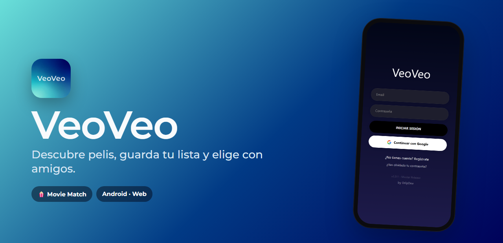

<a href="https://dripdev.dev"></a>

<p align="center">
  
</p>

<p align="center">
  <a href="https://github.com/roblesgg/veoveo/releases/latest"></a>
  <a href="https://veo-veo.vercel.app"></a>
  
</p>

**VeoVeo** sirve para decidir qué ver sin pasar media hora discutiendo. Descubres pelis y series, guardas las que te apetecen y, cuando quedáis, hacéis match.

## Qué puedes hacer

| | |
|---|---|
| 🎬 **Descubrir** | Tendencias, estrenos y clásicos, y un buscador de pelis, series y actores. |
| 👀 **Tu lista** | Lo que quieres ver y lo que ya viste, con filtros. |
| 🤝 **Movie Match** | Tú y tus amigos deslizáis pelis. Cuando coincidís, ya tenéis plan. |
| ⭐ **Tier lists** | Ordena las pelis que has visto de mejor a peor. |
| ❤️ **Social** | Amigos, chat y la lista de cada uno. |

## Úsala

- **Android:** baja `veoveo-latest.apk` de la [última versión](https://github.com/roblesgg/veoveo/releases/latest).
- **Navegador:** [veo-veo.vercel.app](https://veo-veo.vercel.app)

Entras con tu correo o con Google.

## Hecho con

React Native con Expo, Firebase para usuarios y datos, y la base de datos de cine de TMDB.

<details>
<summary><b>Para desarrollar</b></summary>

<br>

```bash
npm install
cp .env.example .env    # claves de TMDB, Firebase y Google
npx expo start
```

La guía de la infraestructura está en [`docs/`](docs/).

</details>

---

<p align="center"><sub>Este producto usa la API de TMDB, pero no está respaldado ni certificado por TMDB.</sub></p>
<p align="center"><sub>Un producto de <a href="https://dripdev.dev"><b>DripDev</b></a> · hecho por Álvaro Robles</sub></p>
