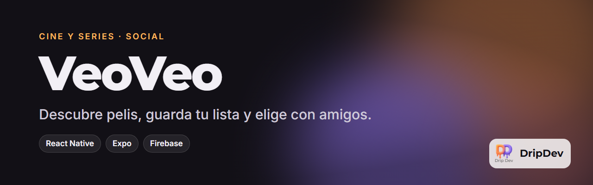

<p align="center">
  
</p>

<p align="center">
  <a href="https://github.com/roblesgg/veoveo/releases/latest"></a>
  <a href="https://veo-veo.vercel.app"></a>
  
  
</p>

**VeoVeo** es una app para descubrir películas y series, llevar la cuenta de lo que has visto y lo que quieres ver, y decidir con tus amigos qué poner esta noche sin pasar media hora discutiendo.

<!-- Capturas: añade las imágenes en docs/capturas/ y descomenta esta sección.
## Capturas
<p align="center">
  
  
  
  
</p>
-->

## Qué puedes hacer

- **Descubrir** novedades y clásicos en carruseles, y buscar cualquier película, serie o actor.
- **Tu biblioteca**: marca lo que tienes por ver y lo que ya viste, con filtros para encontrarlo.
- **Movie Match**: tú y tus amigos deslizáis películas a la derecha o a la izquierda, y cuando coincidís, ya tenéis plan.
- **Tier lists** para ordenar las pelis que has visto de mejor a peor.
- **Social**: amigos, chat y la biblioteca de cada uno.
- **Entra con Google** en un toque.

## Úsala

- **Android:** descarga `veoveo-latest.apk` de la [última versión](https://github.com/roblesgg/veoveo/releases/latest).
- **Navegador:** [veo-veo.vercel.app](https://veo-veo.vercel.app)

## Hecho con

React Native con Expo (SDK 54, nueva arquitectura y Hermes), Firebase para usuarios, datos, archivos y notificaciones, React Navigation y los datos de cine de TMDB.

## Desarrollo

```bash
npm install
cp .env.example .env    # claves de TMDB, Firebase y Google
npx expo start
```

La guía completa de la infraestructura está en [`docs/`](docs/).

## Estado

Publicada. Versión actual en la insignia de arriba.

---

<p align="center">
  <sub>Este producto usa la API de TMDB, pero no está respaldado ni certificado por TMDB.</sub>
</p>

<p align="center">
  <br>
  Un producto de <b>DripDev</b> · hecho por Álvaro Robles
</p>
